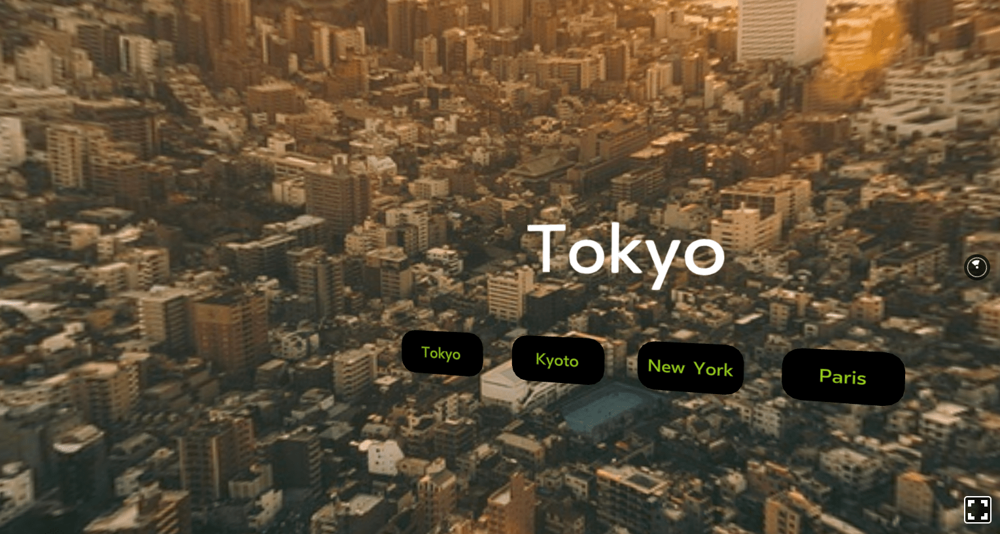
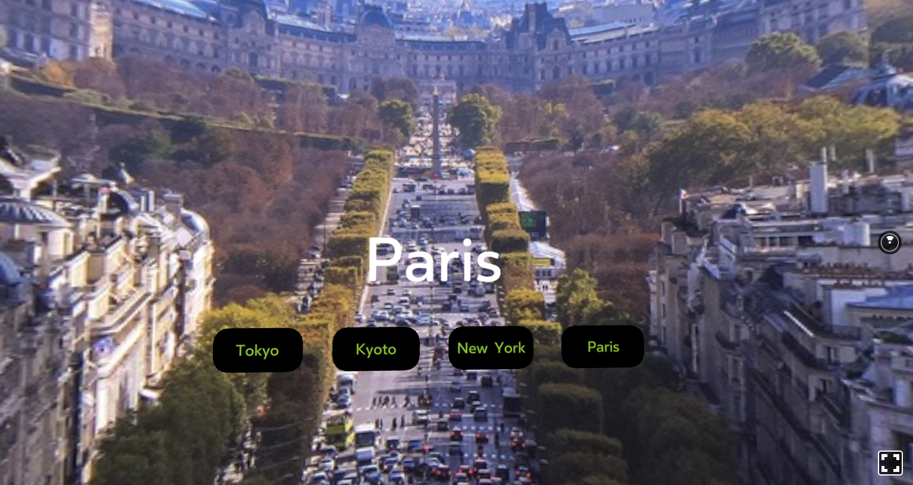

React VR + Redux example
====

This is a React VR + Redux simple example. You can see several buttons in the VR UI and the background image is changed when clicking on the buttons.

## Description
React VR is a tool to create Web VR apps.
You can use React VR in the same manner as React. Many React applications choose Redux to manage application states. You can also use Redux with React VR in the same manner. This example uses Redux as the single store of the app to manage application states.

All you need to see is in index.vr.js. Reducer, Action Creator, Store, React VR components, Redux Container are in the file.

This project is created by using [react-vr](https://github.com/facebook/react-vr) CLI. So you can see the detail information of the example by checking the project.

## Screen shots




## Requirement
- Node.js version 6.0.0 or higher
- `yarn` or `npm` (>= v3.0.0) package managers

## Install
```bash
$ npm i
```
or
```bash
$ yarn
```

## Usage
```bash
$ npm run start
```
or
```bash
$ yarn start
```
then, open http://localhost:8081/vr

## Licence
MIT
